# Shadertoy shaders

This is a backup of all WebGL fragment shaders that I have published on [Shadertoy](https://shadertoy.com).

| Thumbnail      | Title | Published     |
|   :----:   | :---        |         ---: |
| 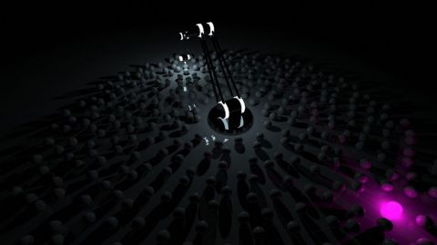 | [Robotic Arm Hunting Lights](./robotic-arm-hunting-lights) | 2019-08-29|
| 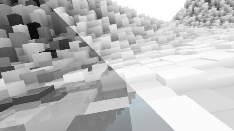 | [Gaussian Weights and Fake AO](./gaussian-weights-and-fake-ao) | 2019-06-24|
|  | [Ray Tracing - Primitives](./ray-tracing---primitives) | 2019-06-03|
|  | [Yet another Cornell Box](./yet-another-cornell-box) | 2019-01-09|
|  | [Portal - iOS AR](./portal---ios-ar) | 2018-10-06|
|  | [Menger Sponge - iOS AR](./menger-sponge---ios-ar) | 2018-10-06|
| 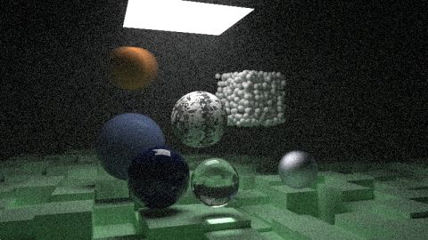 | [RIOW 2.09: A Scene Testing All](./riow-209-a-scene-testing-all) | 2018-09-07|
| 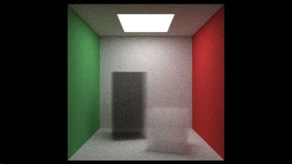 | [RIOW 2.08: Volumes](./riow-208-volumes) | 2018-09-07|
|  | [RIOW 2.07: Instances](./riow-207-instances) | 2018-09-07|
|  | [RIOW 2.06: Rectangles and lights](./riow-206-rectangles-and-lights) | 2018-09-07|
|  | [RIOW 1.12: Where next?](./riow-112-where-next) | 2018-09-04|
|  | [RIOW 1.11: Defocus Blur](./riow-111-defocus-blur) | 2018-09-04|
|  | [RIOW 1.09: Dielectrics](./riow-109-dielectrics) | 2018-09-04|
|  | [RIOW 1.07: Diffuse](./riow-107-diffuse) | 2018-09-04|
|  | [Old watch (RT)](./old-watch-rt) | 2018-08-26|
|  | [A smaller quine](./a-smaller-quine) | 2018-08-21|
| 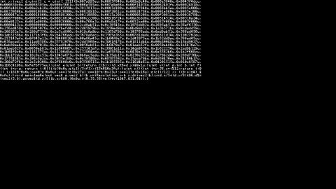 | [A quine](./a-quine) | 2018-08-12|
|  | [[SH18] Woman](./sh18-woman) | 2018-08-10|
|  | [[SH18] Human Document](./sh18-human-document) | 2018-07-25|
| 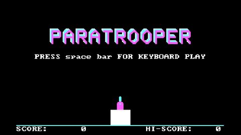 | [Paratrooper (game)](./paratrooper-game) | 2018-07-04|
| 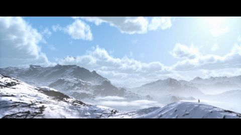 | [Himalayas](./himalayas) | 2018-05-29|
|  | [Old watch (IBL)](./old-watch-ibl) | 2018-04-30|
|  | [Contrast speed illusion](./contrast-speed-illusion) | 2017-11-28|
|  | [Super simple raymarching example](./super-simple-raymarching-example) | 2017-07-30|
|  | [[SH17C] Raymarching tutorial](./sh17c-raymarching-tutorial) | 2017-07-30|
|  | [[SH17B] Legend of the Gelatinous](./sh17b-legend-of-the-gelatinous) | 2017-07-25|
|  | [[SH17A] Matrix rain](./sh17a-matrix-rain) | 2017-07-18|
|  | [[SH17A] Metaballs](./sh17a-metaballs) | 2017-07-18|
|  | [[SH16B] Speed tracer](./sh16b-speed-tracer) | 2016-07-17|
| 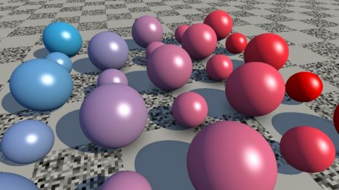 | [[SH16A] Reinder](./sh16a-reinder) | 2016-07-04|
| 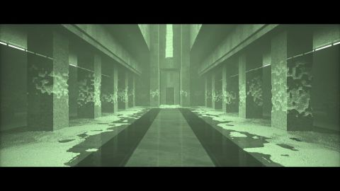 | [Matrix Lobby Scene (MP)](./matrix-lobby-scene-mp) | 2016-03-28|
| 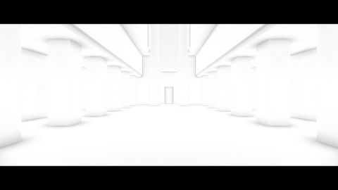 | [Post process - SSAO](./post-process---ssao) | 2016-01-05|
|  | [Post process - FXAA](./post-process---fxaa) | 2016-01-04|
|  | [Matrix rain < 200 char](./matrix-rain--200-char) | 2015-11-15|
| 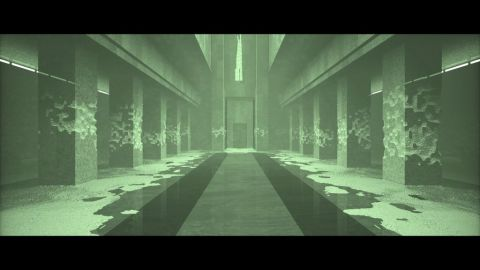 | [[SIG15] Matrix Lobby Scene](./sig15-matrix-lobby-scene) | 2015-08-07|
| 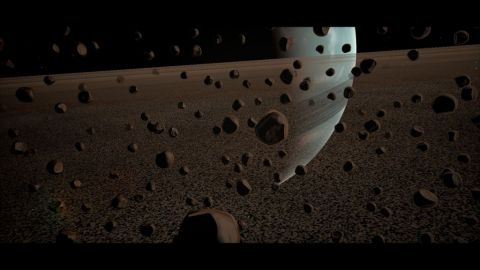 | [Planet Shadertoy](./planet-shadertoy) | 2015-03-30|
|  | [[NV15] Space](./nv15-space) | 2015-03-20|
|  | [[2TC 15] Psychedelic Sand Dunes](./2tc-15-psychedelic-sand-dunes) | 2015-01-29|
|  | [[2TC 15] Minecraft](./2tc-15-minecraft) | 2015-01-29|
|  | [[2TC 15] Toxic lake](./2tc-15-toxic-lake) | 2015-01-29|
|  | [Bidirectional path tracer 2](./bidirectional-path-tracer-2) | 2015-01-06|
| 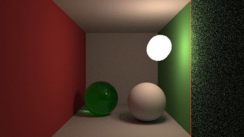 | [Simple path tracer](./simple-path-tracer) | 2014-12-23|
| 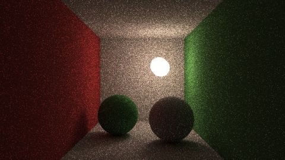 | [Bidirectional path tracing](./bidirectional-path-tracing) | 2014-12-19|
|  | [Tokyo](./tokyo) | 2014-12-07|
|  | [Folding](./folding) | 2014-11-18|
|  | [Abandoned base](./abandoned-base) | 2014-08-30|
|  | [Misty Lake](./misty-lake) | 2013-12-01|
|  | [Doom 2](./doom-2) | 2013-11-17|
| 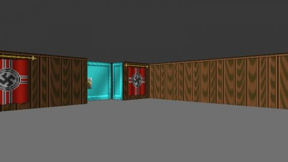 | [Wolfenstein 3D](./wolfenstein-3d) | 2013-09-25|
| 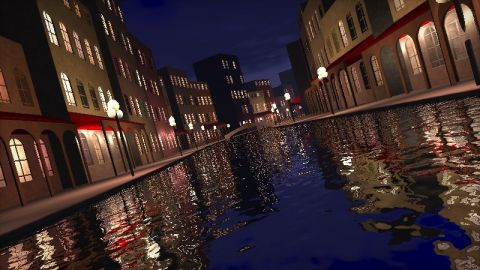 | [Venice](./venice) | 2013-09-18|
|  | [Water world](./water-world) | 2013-09-12|
|  | [Minecraft](./minecraft) | 2013-09-06|
|  | [Oculus rift & Spheres](./oculus-rift--spheres) | 2013-05-24|
|  | [Mars demo](./mars-demo) | 2013-05-18|
|  | [More spheres](./more-spheres) | 2013-05-15|
| 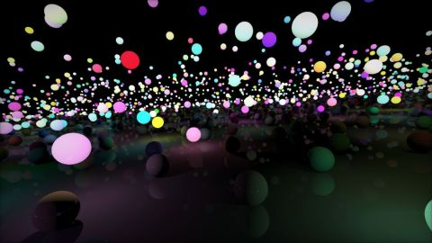 | [A lot of spheres](./a-lot-of-spheres) | 2013-05-14|
|  | [Outrun](./outrun) | 2013-04-30|
|  | [Escher's prentententoonstelling](./eschers-prentententoonstelling) | 2013-04-14|
| 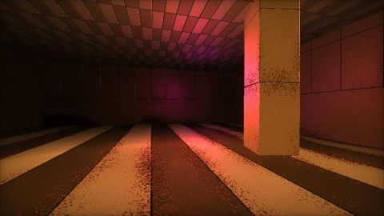 | [Abandoned base on Mars](./abandoned-base-on-mars) | 2013-04-05|
| 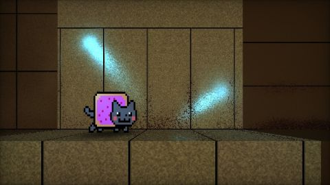 | [Nyan](./nyan) | 2013-04-03|
| 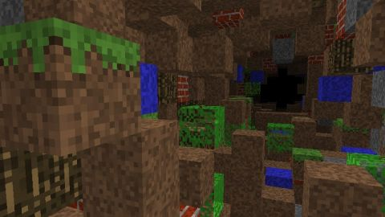 | [Minecraft Blocks](./minecraft-blocks) | 2013-03-28|
|  | [Moonlight](./moonlight) | 2013-03-25|

## Links
* [An overview of all my shaders](https://reindernijhoff.net/shadertoy/)
* [My public profile](https://www.shadertoy.com/user/reinder) on Shadertoy
