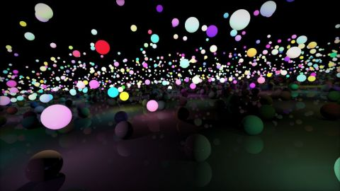

# A lot of spheres
[View shader on Shadertoy](https://www.shadertoy.com/view/lsX3WH) - _Published on 2013-05-14_ 

Simple raytracer showing a lot of spheres and lightsources. A grid is used as an acceleration structure.
## Shaders

### Image

Source: [Image.glsl](./Image.glsl)

## Links
* [A lot of spheres](https://www.shadertoy.com/view/lsX3WH) on Shadertoy
* [An overview of all my shaders](https://reindernijhoff.net/shadertoy/)
* [My public profile](https://www.shadertoy.com/user/reinder) on Shadertoy

## License

[Creative Commons Attribution-NonCommercial-ShareAlike 3.0 Unported License.](https://creativecommons.org/licenses/by-nc-sa/3.0/)
