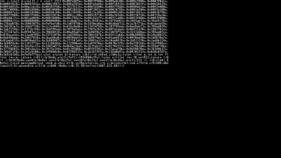

# A quine
[View shader on Shadertoy](https://www.shadertoy.com/view/llcyD2) - _Published on 2018-08-12_ 

This is [done](https://www.shadertoy.com/view/Ml3SWj) [before](https://www.shadertoy.com/view/Mlj3zR) and my code is not the most [optimised](https://www.shadertoy.com/view/MlGcRz), but it is nice to write your own quine!
## Shaders

### Image

Source: [Image.glsl](./Image.glsl)

## Links
* [A quine](https://www.shadertoy.com/view/llcyD2) on Shadertoy
* [An overview of all my shaders](https://reindernijhoff.net/shadertoy/)
* [My public profile](https://www.shadertoy.com/user/reinder) on Shadertoy

## License

[Creative Commons Attribution-NonCommercial-ShareAlike 3.0 Unported License.](https://creativecommons.org/licenses/by-nc-sa/3.0/)
