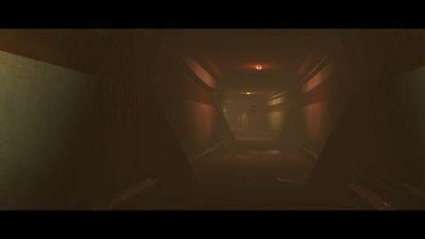

# Abandoned base
[View shader on Shadertoy](https://www.shadertoy.com/view/XsSSRW) - _Published on 2014-08-30_ 

My entry to the in-official, nonexistent st mine compo :) If you like shiny things, define 'GOLD' at line 3. Use your mouse to look around.
## Shaders

### Sound

Source: [Sound.glsl](./Sound.glsl)

#### Inputs

 * **iChannel0**: [texture](https://shadertoy.com/media/a/f735bee5b64ef98879dc618b016ecf7939a5756040c2cde21ccb15e69a6e1cfb.png) _(mipmap, repeat, vflipped)_

### Image

Source: [Image.glsl](./Image.glsl)

#### Inputs

 * **iChannel0**: [texture](https://shadertoy.com/media/a/95b90082f799f48677b4f206d856ad572f1d178c676269eac6347631d4447258.jpg) _(mipmap, repeat, vflipped)_

## Links
* [Abandoned base](https://www.shadertoy.com/view/XsSSRW) on Shadertoy
* [An overview of all my shaders](https://reindernijhoff.net/shadertoy/)
* [My public profile](https://www.shadertoy.com/user/reinder) on Shadertoy

## License

[Creative Commons Attribution-NonCommercial-ShareAlike 3.0 Unported License.](https://creativecommons.org/licenses/by-nc-sa/3.0/)
