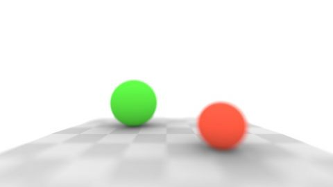

# Cameras and Lenses
[View shader on Shadertoy](https://www.shadertoy.com/view/wdyBRV) - _Published on 2020-12-09_ 

Based on the shaders of the excellent article 'Cameras and Lenses' by @BCiechanowski: [URL]https://ciechanow.ski/cameras-and-lenses[/URL]. Use your mouse to focus.
## Shaders

### Image

Source: [Image.glsl](./Image.glsl)

## Links
* [Cameras and Lenses](https://www.shadertoy.com/view/wdyBRV) on Shadertoy
* [An overview of all my shaders](https://reindernijhoff.net/shadertoy/)
* [My public profile](https://www.shadertoy.com/user/reinder) on Shadertoy

## License

[Creative Commons Attribution-NonCommercial-ShareAlike 4.0 International License.](https://creativecommons.org/licenses/by-nc-sa/4.0/)
