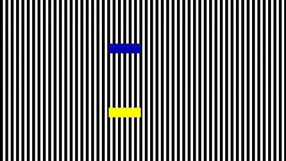

# Contrast speed illusion
[View shader on Shadertoy](https://www.shadertoy.com/view/MtfBDN) - _Published on 2017-11-28_ 

Both rectangles are moving at exactly the same speed.

Based on the flash implementation by Jim Cash: https://scratch.mit.edu/projects/188838060/

Research paper:

https://quote.ucsd.edu/anstislab/files/2012/11/2001-Footsteps-and-inchworms.pdf

## Shaders

### Image

Source: [Image.glsl](./Image.glsl)

## Links
* [Contrast speed illusion](https://www.shadertoy.com/view/MtfBDN) on Shadertoy
* [An overview of all my shaders](https://reindernijhoff.net/shadertoy/)
* [My public profile](https://www.shadertoy.com/user/reinder) on Shadertoy

## License

[Creative Commons Attribution-NonCommercial-ShareAlike 4.0 International License.](https://creativecommons.org/licenses/by-nc-sa/4.0/)
