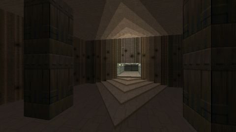

# Doom 2
[View shader on Shadertoy](https://www.shadertoy.com/view/lsB3zD) - _Published on 2013-11-17_ 

Reconstructing the first level of Doom 2 in a shader. This is, just like my shader 'Wolfenstein' ([url]https://www.shadertoy.com/view/4sfGWX[/url]), an experiment to reconstruct some well-known textures in a textureless shader.
## Shaders

### Image

Source: [Image.glsl](./Image.glsl)

## Links
* [Doom 2](https://www.shadertoy.com/view/lsB3zD) on Shadertoy
* [An overview of all my shaders](https://reindernijhoff.net/shadertoy/)
* [My public profile](https://www.shadertoy.com/user/reinder) on Shadertoy

## License

[Creative Commons Attribution-NonCommercial-ShareAlike 3.0 Unported License.](https://creativecommons.org/licenses/by-nc-sa/3.0/)
