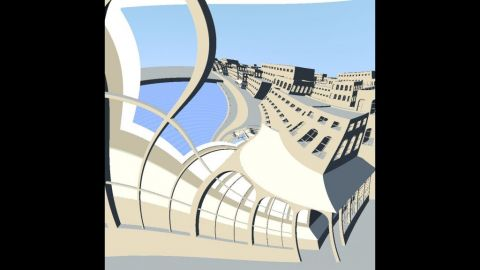

# Escher's prentententoonstelling
[View shader on Shadertoy](https://www.shadertoy.com/view/Mdf3zM) - _Published on 2013-04-14_ 




Study of the transformation of Escher in 'the prentententoonstelling'
```
h(w) = w^((2πi + log scale)/(2πi))
```
Distance field functions by Inigo Quilez.

[1] http://www.ams.org/notices/200304/fea-escher.pdf


## Shaders

### Image

Source: [Image.glsl](./Image.glsl)

## Links
* [Escher's prentententoonstelling](https://www.shadertoy.com/view/Mdf3zM) on Shadertoy
* [An overview of all my shaders](https://reindernijhoff.net/shadertoy/)
* [My public profile](https://www.shadertoy.com/user/reinder) on Shadertoy
* [http://www.ams.org/notices/200304/fea-escher.pdf](http://www.ams.org/notices/200304/fea-escher.pdf)

## License

[Creative Commons Attribution-NonCommercial-ShareAlike 4.0 International License.](https://creativecommons.org/licenses/by-nc-sa/4.0/)
