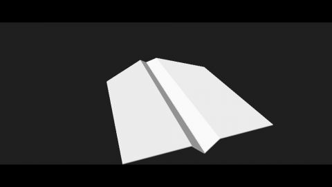

# Folding
[View shader on Shadertoy](https://www.shadertoy.com/view/MdjXDV) - _Published on 2014-11-18_ 

I was hoping that 'folding' the input domain of the distance function would lead to some elegant math. Unfortunately, the math isn't that elegant at all, and also it isn't stable for large folding-angles (hence the 'clipping hack' at lines 90 to 99).
## Shaders

### Image

Source: [Image.glsl](./Image.glsl)

## Links
* [Folding](https://www.shadertoy.com/view/MdjXDV) on Shadertoy
* [An overview of all my shaders](https://reindernijhoff.net/shadertoy/)
* [My public profile](https://www.shadertoy.com/user/reinder) on Shadertoy

## License

[Creative Commons Attribution-NonCommercial-ShareAlike 3.0 Unported License.](https://creativecommons.org/licenses/by-nc-sa/3.0/)
