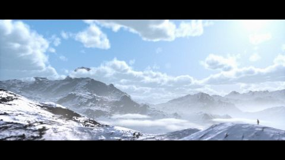

# Himalayas
[View shader on Shadertoy](https://www.shadertoy.com/view/MdGfzh) - _Published on 2018-05-29_ 

This is my first attempt to render volumetric clouds in a fragment shader.

I started this shader by trying to implement the clouds of Horizon Zero Dawn, as
described in "The real-time volumetric cloudscapes of Horizon Zero Dawn" by
Andrew Schneider and Nathan Vos.[1] To model the shape of the clouds, two look-up
textures are created with different frequencies of (Perlin -) Worley noise:

Buffer A: The main look-up texture for the cloud shapes.
Buffer B: A 3D (32x32x32) look-up texture with Worley Noise used to add small details
to the shapes of the clouds. I have packed this 3D texture into a 2D buffer.

Because it is not possible (yet) to create buffers with fixed size, or 3D buffers, the
look-up texture in Buffer A is 2D, and a slice of the volume that is described in the
article. Therefore, and because I didn't have any slots left (in Buffer C) to use a
cloud type/cloud coverage texture, the modelling of the cloud shapes in this shader is
in the end mostly based on trial and error, and is probably far from the code used in
Horizon Zero Dawn.

Buffer D: Rendering of the clouds.

I render the clouds using the improved integration method of volumetric media, as described
in "Physically Based Sky, Atmosphere and Cloud Rendering in Frostbite" by
Sébastien Hillaire.[2]

You can find the (excellent) example shaders of Sébastien Hillaire (SebH) here:

https://www.shadertoy.com/view/XlBSRz
https://www.shadertoy.com/view/MdlyDs

Buffer C: Landscape

To create an interesting scene and to add some scale to the clouds, I render a
terrain using a simple heightmap, based on the work by Íñigo Quílez on value noise and its
analytical derivatives.[3]

In fact, the heightmap of this shader is almost exactly the same as the heightmap that
is used in Íñigo Quílez' shader Elevated:

https://www.shadertoy.com/view/MdX3Rr

To reduce noise I use temporal reprojection (both for clouds (Buffer D) and the terrain
(Buffer C)) separatly. The temporal reprojection code is based on code from the shader
"Rain Forest" (again by Íñigo Quílez):

https://www.shadertoy.com/view/4ttSWf

Finally, in the Image tab, clouds and terrain are combined, a small humanoid is added
(by Hazel Quantock) and post processing is done.

[1] https://www.guerrilla-games.com/read/the-real-time-volumetric-cloudscapes-of-horizon-zero-dawn

[2] https://media.contentapi.ea.com/content/dam/eacom/frostbite/files/s2016-pbs-frostbite-sky-clouds-new.pdf

[3] http://iquilezles.org/www/articles/morenoise/morenoise.htm

## Shaders

### Common

Source: [Common.glsl](./Common.glsl)

### Buffer A

Source: [Buffer A.glsl](./Buffer&#32;A.glsl)

#### Inputs

 * **iChannel0**: Buffer A _(linear, repeat, vflipped)_
 * **iChannel1**: Buffer D _(linear, clamp, vflipped)_

### Buffer B

Source: [Buffer B.glsl](./Buffer&#32;B.glsl)

#### Inputs

 * **iChannel0**: Buffer B _(linear, repeat, vflipped)_
 * **iChannel1**: Buffer D _(linear, clamp, vflipped)_

### Buffer C

Source: [Buffer C.glsl](./Buffer&#32;C.glsl)

#### Inputs

 * **iChannel0**: Buffer C _(linear, clamp, vflipped)_
 * **iChannel1**: Buffer D _(linear, clamp, vflipped)_

### Buffer D

Source: [Buffer D.glsl](./Buffer&#32;D.glsl)

#### Inputs

 * **iChannel0**: Buffer A _(linear, repeat, vflipped)_
 * **iChannel1**: Buffer D _(linear, clamp, vflipped)_
 * **iChannel2**: Buffer C _(linear, clamp, vflipped)_
 * **iChannel3**: Buffer B _(linear, repeat, vflipped)_

### Image

Source: [Image.glsl](./Image.glsl)

#### Inputs

 * **iChannel0**: Buffer C _(linear, clamp, vflipped)_
 * **iChannel1**: Buffer D _(linear, clamp, vflipped)_

## Links
* [Himalayas](https://www.shadertoy.com/view/MdGfzh) on Shadertoy
* [An overview of all my shaders](https://reindernijhoff.net/shadertoy/)
* [My public profile](https://www.shadertoy.com/user/reinder) on Shadertoy
* [https://www.guerrilla-games.com/read/the-real-time-volumetric-cloudscapes-of-horizon-zero-dawn](https://www.guerrilla-games.com/read/the-real-time-volumetric-cloudscapes-of-horizon-zero-dawn)
* [https://media.contentapi.ea.com/content/dam/eacom/frostbite/files/s2016-pbs-frostbite-sky-clouds-new.pdf](https://media.contentapi.ea.com/content/dam/eacom/frostbite/files/s2016-pbs-frostbite-sky-clouds-new.pdf)
* [http://iquilezles.org/www/articles/morenoise/morenoise.htm](http://iquilezles.org/www/articles/morenoise/morenoise.htm)

## License

[Creative Commons Attribution-NonCommercial-ShareAlike 4.0 International License.](https://creativecommons.org/licenses/by-nc-sa/4.0/)
