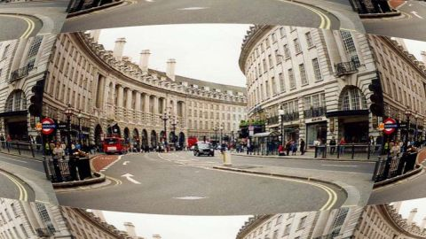

# Inverse Barrel Distortion
[View shader on Shadertoy](https://www.shadertoy.com/view/Wd3XDr) - _Published on 2019-10-22_ 




The inverse of a Barrel Distortion.

I couldn't find this function online, so I derived it myself.
A surprisingly complex formula ;-).

```
uv -= .5;

float b = distortion;
float l = length(uv);

float x0 = pow(9.*b*b*l + sqrt(3.) * sqrt(27.*b*b*b*b*l*l + 4.*b*b*b), 1./3.);
float x = x0 / (pow(2., 1./3.) * pow(3., 2./3.) * b) - pow(2./3., 1./3.) / x0;

return uv * (x / l) + .5;
```


## Shaders

### Image

Source: [Image.glsl](./Image.glsl)

#### Inputs

 * **iChannel0**: [texture](https://shadertoy.com/media/a/8de3a3924cb95bd0e95a443fff0326c869f9d4979cd1d5b6e94e2a01f5be53e9.jpg) _(mipmap, repeat, vflipped)_

## Links
* [Inverse Barrel Distortion](https://www.shadertoy.com/view/Wd3XDr) on Shadertoy
* [An overview of all my shaders](https://reindernijhoff.net/shadertoy/)
* [My public profile](https://www.shadertoy.com/user/reinder) on Shadertoy

## License

[The MIT License.](https://opensource.org/licenses/MIT)
