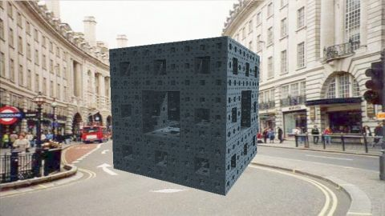

# Menger Sponge - iOS AR
[View shader on Shadertoy](https://www.shadertoy.com/view/XttfRN) - _Published on 2018-10-06_ 

This is an experiment to create an "AR shader" by implementing the mainVR-function and
using the WebCam texture as background. If you view this shader with the Shadertoy iOS
app[1], you can walk around the cube to view it from all sides.

If you don't have an iOS device (or if you don't have the app installed) you can find a
screen capture of the shader in action here: https://youtu.be/7woT6cTx-bo.

The SDF of this shader is based on the "Menger Sponge" shader by Íñigo Quílez:
https://www.shadertoy.com/view/4sX3Rn

[1] https://itunes.apple.com/us/app/shadertoy/id717961814

## Shaders

### Image

Source: [Image.glsl](./Image.glsl)

#### Inputs

 * **iChannel0**: webcam _(mipmap, clamp, vflipped)_
 * **iChannel1**: [texture](https://shadertoy.com/media/a/8de3a3924cb95bd0e95a443fff0326c869f9d4979cd1d5b6e94e2a01f5be53e9.jpg) _(mipmap, repeat, vflipped)_
 * **iChannel2**: [texture](https://shadertoy.com/media/a/79520a3d3a0f4d3caa440802ef4362e99d54e12b1392973e4ea321840970a88a.jpg) _(mipmap, repeat, vflipped)_

## Links
* [Menger Sponge - iOS AR](https://www.shadertoy.com/view/XttfRN) on Shadertoy
* [An overview of all my shaders](https://reindernijhoff.net/shadertoy/)
* [My public profile](https://www.shadertoy.com/user/reinder) on Shadertoy
* [https://itunes.apple.com/us/app/shadertoy/id717961814](https://itunes.apple.com/us/app/shadertoy/id717961814)

## License

[Creative Commons Attribution-NonCommercial-ShareAlike 4.0 International License.](https://creativecommons.org/licenses/by-nc-sa/4.0/)
