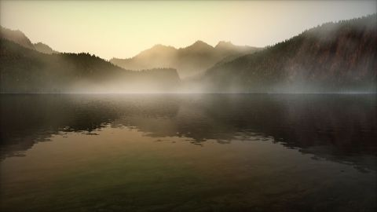

# Misty Lake
[View shader on Shadertoy](https://www.shadertoy.com/view/MsB3WR) - _Published on 2013-12-01_ 

A misty lake in the morning. Cloud and noise functions by Inigo Quilez.

You can use your mouse to look around.
## Shaders

### Image

Source: [Image.glsl](./Image.glsl)

#### Inputs

 * **iChannel0**: [texture](https://shadertoy.com/media/a/f735bee5b64ef98879dc618b016ecf7939a5756040c2cde21ccb15e69a6e1cfb.png) _(mipmap, repeat, vflipped)_
 * **iChannel1**: [texture](https://shadertoy.com/media/a/52d2a8f514c4fd2d9866587f4d7b2a5bfa1a11a0e772077d7682deb8b3b517e5.jpg) _(mipmap, repeat, vflipped)_
 * **iChannel2**: [texture](https://shadertoy.com/media/a/fb918796edc3d2221218db0811e240e72e340350008338b0c07a52bd353666a6.jpg) _(mipmap, repeat, vflipped)_

## Links
* [Misty Lake](https://www.shadertoy.com/view/MsB3WR) on Shadertoy
* [An overview of all my shaders](https://reindernijhoff.net/shadertoy/)
* [My public profile](https://www.shadertoy.com/user/reinder) on Shadertoy

## License

[Creative Commons Attribution-NonCommercial-ShareAlike 3.0 Unported License.](https://creativecommons.org/licenses/by-nc-sa/3.0/)
