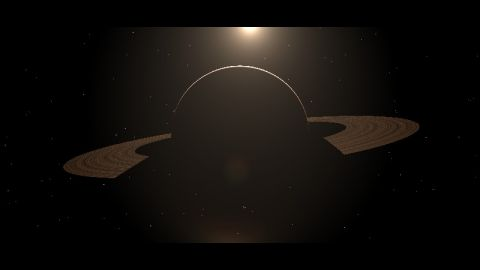

# [NV15] Space
[View shader on Shadertoy](https://www.shadertoy.com/view/ltjGRz) - _Published on 2015-03-20_ 

Space - winner of the 'best visuals' category of the Shadertoy Hackathon @ NVSCENE 2015.

See [4tjGRh](https://www.shadertoy.com/view/4tjGRh) for the updated shader with space-to-surface flight.
## Shaders

### Sound

Source: [Sound.glsl](./Sound.glsl)

### Image

Source: [Image.glsl](./Image.glsl)

## Links
* [[NV15] Space](https://www.shadertoy.com/view/ltjGRz) on Shadertoy
* [An overview of all my shaders](https://reindernijhoff.net/shadertoy/)
* [My public profile](https://www.shadertoy.com/user/reinder) on Shadertoy

## License

[Creative Commons Attribution-NonCommercial-ShareAlike 4.0 International License.](https://creativecommons.org/licenses/by-nc-sa/4.0/)
