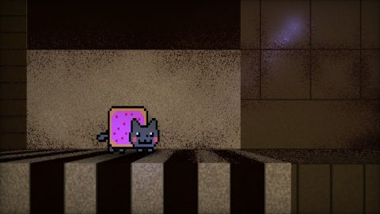

# Nyan
[View shader on Shadertoy](https://www.shadertoy.com/view/XsfGzM) - _Published on 2013-04-03_ 

Nyan exploring. The shader shows the procedural textures of my shader 'Abandond base on Mars': https://www.shadertoy.com/view/4sfGR7.
## Shaders

### Image

Source: [Image.glsl](./Image.glsl)

#### Inputs

 * **iChannel0**: [texture](https://shadertoy.com/media/a/cd4c518bc6ef165c39d4405b347b51ba40f8d7a065ab0e8d2e4f422cbc1e8a43.jpg) _(mipmap, repeat, vflipped)_
 * **iChannel1**: [texture](https://shadertoy.com/media/a/cbcbb5a6cfb55c36f8f021fbb0e3f69ac96339a39fa85cd96f2017a2192821b5.png) _(nearest, clamp, vflipped)_

## Links
* [Nyan](https://www.shadertoy.com/view/XsfGzM) on Shadertoy
* [An overview of all my shaders](https://reindernijhoff.net/shadertoy/)
* [My public profile](https://www.shadertoy.com/user/reinder) on Shadertoy

## License

[Creative Commons Attribution-NonCommercial-ShareAlike 4.0 International License.](https://creativecommons.org/licenses/by-nc-sa/4.0/)
