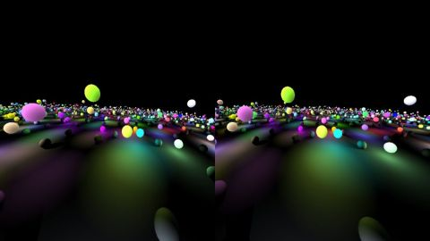

# Oculus rift & Spheres
[View shader on Shadertoy](https://www.shadertoy.com/view/lds3D8) - _Published on 2013-05-24_ 

Just a modification of the shader 'lot of spheres', so you can use it with the Oculus Rift (http://www.oculusvr.com/). All constants are empircal measured. Run the shader full screen.
## Shaders

### Image

Source: [Image.glsl](./Image.glsl)

## Links
* [Oculus rift & Spheres](https://www.shadertoy.com/view/lds3D8) on Shadertoy
* [An overview of all my shaders](https://reindernijhoff.net/shadertoy/)
* [My public profile](https://www.shadertoy.com/user/reinder) on Shadertoy

## License

[Creative Commons Attribution-NonCommercial-ShareAlike 3.0 Unported License.](https://creativecommons.org/licenses/by-nc-sa/3.0/)
