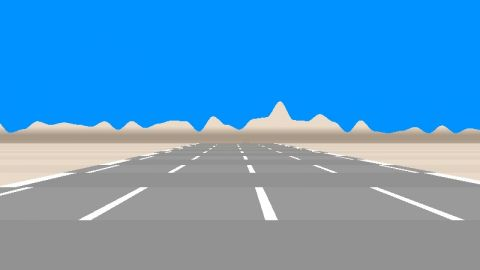

# Outrun
[View shader on Shadertoy](https://www.shadertoy.com/view/Mdf3Dr) - _Published on 2013-04-30_ 

Just a quick one. Please don't look at the source of this shader :) The math is a mess and full of magical numbers and physical incorrect
## Shaders

### Image

Source: [Image.glsl](./Image.glsl)

## Links
* [Outrun](https://www.shadertoy.com/view/Mdf3Dr) on Shadertoy
* [An overview of all my shaders](https://reindernijhoff.net/shadertoy/)
* [My public profile](https://www.shadertoy.com/user/reinder) on Shadertoy

## License

[Creative Commons Attribution-NonCommercial-ShareAlike 3.0 Unported License.](https://creativecommons.org/licenses/by-nc-sa/3.0/)
