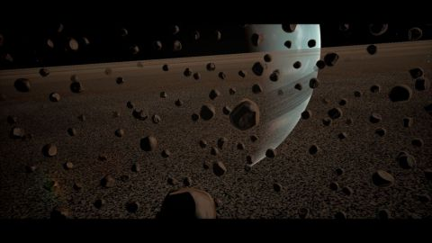

# Planet Shadertoy
[View shader on Shadertoy](https://www.shadertoy.com/view/4tjGRh) - _Published on 2015-03-30_ 

It uses code from the following shaders:

Wet stone by TDM
Atmospheric Scattering by GLtracy
Seascape by TDM
Elevated and Terrain Tubes by IQ
LLamels by Eiffie
Lens flare by Musk

## Shaders

### Sound

Source: [Sound.glsl](./Sound.glsl)

### Image

Source: [Image.glsl](./Image.glsl)

## Links
* [Planet Shadertoy](https://www.shadertoy.com/view/4tjGRh) on Shadertoy
* [An overview of all my shaders](https://reindernijhoff.net/shadertoy/)
* [My public profile](https://www.shadertoy.com/user/reinder) on Shadertoy

## License

[Creative Commons Attribution-NonCommercial-ShareAlike 4.0 International License.](https://creativecommons.org/licenses/by-nc-sa/4.0/)
