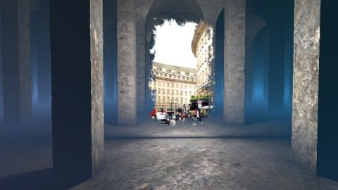

# Portal - iOS AR
[View shader on Shadertoy](https://www.shadertoy.com/view/lldcR8) - _Published on 2018-10-06_ 

This is an experiment to create an "AR shader" by implementing the mainVR-function and
using the WebCam texture as background. If you view this shader with the Shadertoy iOS
app[1], you can walk around and enter the portal.

If you don't have an iOS device (or if you don't have the app installed) you can find a
screen capture of the shader in action here: https://youtu.be/IzeeoD0e6Ow.

Common tab: The VR-scene is shaded using analytical area lighting. I have used code of
dys129 shader "Analytic Area Light" to implement this technique:
https://www.shadertoy.com/view/4tXSR4

Buffer A:   Buffer A keeps track of the camera-position and calculates if the user has
entered the portal.

Image tab:  A raymarcher is used to render the VR scene.

[1] https://itunes.apple.com/us/app/shadertoy/id717961814

## Shaders

### Common

Source: [Common.glsl](./Common.glsl)

### Buffer A

Source: [Buffer A.glsl](./Buffer&#32;A.glsl)

#### Inputs

 * **iChannel0**: Buffer A _(nearest, clamp, vflipped)_

### Image

Source: [Image.glsl](./Image.glsl)

#### Inputs

 * **iChannel0**: webcam _(mipmap, clamp, vflipped)_
 * **iChannel1**: Buffer A _(nearest, clamp, vflipped)_
 * **iChannel2**: [texture](https://shadertoy.com/media/a/79520a3d3a0f4d3caa440802ef4362e99d54e12b1392973e4ea321840970a88a.jpg) _(mipmap, repeat, vflipped)_
 * **iChannel3**: [texture](https://shadertoy.com/media/a/8de3a3924cb95bd0e95a443fff0326c869f9d4979cd1d5b6e94e2a01f5be53e9.jpg) _(mipmap, repeat, vflipped)_

## Links
* [Portal - iOS AR](https://www.shadertoy.com/view/lldcR8) on Shadertoy
* [An overview of all my shaders](https://reindernijhoff.net/shadertoy/)
* [My public profile](https://www.shadertoy.com/user/reinder) on Shadertoy
* [https://itunes.apple.com/us/app/shadertoy/id717961814](https://itunes.apple.com/us/app/shadertoy/id717961814)

## License

[Creative Commons Attribution-NonCommercial-ShareAlike 3.0 Unported License.](https://creativecommons.org/licenses/by-nc-sa/3.0/)
