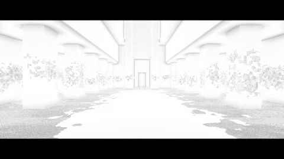

# Post process - SSAO
[View shader on Shadertoy](https://www.shadertoy.com/view/Ms33WB) - _Published on 2016-01-05_ 

demonstrating post process Screen Space Ambient Occlusion applied to a depth and normal map
with the geometry of my shader '[SIG15] Matrix Lobby Scene':

https://www.shadertoy.com/view/MtsXzf

## Shaders

### Buffer A

Source: [Buffer A.glsl](./Buffer&#32;A.glsl)

#### Inputs

 * **iChannel0**: [texture](https://shadertoy.com/media/a/f735bee5b64ef98879dc618b016ecf7939a5756040c2cde21ccb15e69a6e1cfb.png) _(mipmap, repeat, vflipped)_

### Image

Source: [Image.glsl](./Image.glsl)

#### Inputs

 * **iChannel0**: Buffer A _(linear, clamp, vflipped)_

## Links
* [Post process - SSAO](https://www.shadertoy.com/view/Ms33WB) on Shadertoy
* [An overview of all my shaders](https://reindernijhoff.net/shadertoy/)
* [My public profile](https://www.shadertoy.com/user/reinder) on Shadertoy

## License

[Creative Commons Attribution-NonCommercial-ShareAlike 3.0 Unported License.](https://creativecommons.org/licenses/by-nc-sa/3.0/)
