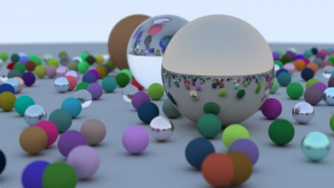

# RIOW 1.12: Where next?
[View shader on Shadertoy](https://www.shadertoy.com/view/XlycWh) - _Published on 2018-09-04_ 

These shaders are my implementation of the raytracer described in the (excellent)
book "Raytracing in one weekend" [1] by Peter Shirley (@Peter_shirley). I have tried
to follow the code from his book as much as possible, but I had to make some changes
to get it running in a fragment shader:

- There are no classes (and methods) in glsl so I use structs and functions instead.
Inheritance is implemented by adding a type variable to the struct and adding ugly
if/else statements to the (not so overloaded) functions.
- The scene description is procedurally implemented in the world_hit function to save
memory.
- The color function is implemented using a loop because it is not possible to have a
recursive function call in glsl.
- Only one sample per pixel per frame is calculated. Samples of all frames are added
in Buffer A and averaged in the Image tab.

You can find the raytracer / pathtracer in Buffer A.

#### = Ray tracing in one week =
* Chapter  7: Diffuse                           https://www.shadertoy.com/view/llVcDz
* Chapter  9: Dielectrics                       https://www.shadertoy.com/view/MlVcDz
* Chapter 11: Defocus blur                      https://www.shadertoy.com/view/XlGcWh
* Chapter 12: Where next?                       https://www.shadertoy.com/view/XlycWh

#### = Ray tracing: the next week =
* Chapter  6: Rectangles and lights             https://www.shadertoy.com/view/4tGcWD
* Chapter  7: Instances                         https://www.shadertoy.com/view/XlGcWD
* Chapter  8: Volumes                           https://www.shadertoy.com/view/XtyyDD
* Chapter  9: A Scene Testing All New Features  https://www.shadertoy.com/view/MtycDD

This particular shader can be optimized (a lot) by using an acceleration structure,
as done in my shader "More spheres": https://www.shadertoy.com/view/lsX3DH

[1] http://in1weekend.blogspot.com/2016/01/ray-tracing-in-one-weekend.html

## Shaders

### Buffer A

Source: [Buffer A.glsl](./Buffer&#32;A.glsl)

#### Inputs

 * **iChannel0**: Buffer A _(linear, clamp, vflipped)_

### Image

Source: [Image.glsl](./Image.glsl)

#### Inputs

 * **iChannel0**: Buffer A _(linear, clamp, vflipped)_

## Links
* [RIOW 1.12: Where next?](https://www.shadertoy.com/view/XlycWh) on Shadertoy
* [An overview of all my shaders](https://reindernijhoff.net/shadertoy/)
* [My public profile](https://www.shadertoy.com/user/reinder) on Shadertoy
* [http://in1weekend.blogspot.com/2016/01/ray-tracing-in-one-weekend.html](http://in1weekend.blogspot.com/2016/01/ray-tracing-in-one-weekend.html)

## License

[Creative Commons Attribution-NonCommercial-ShareAlike 4.0 International License.](https://creativecommons.org/licenses/by-nc-sa/4.0/)
