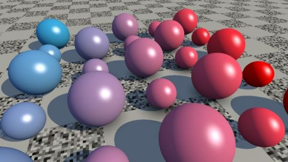

# [SH16A] Reinder
[View shader on Shadertoy](https://www.shadertoy.com/view/4tcGRr) - _Published on 2016-07-04_ 

[SH16A] Challenge. This is work in progress. For now no change to code flow / algorithm is made.
## Shaders

### Image

Source: [Image.glsl](./Image.glsl)

#### Inputs

 * **iChannel0**: [texture](https://shadertoy.com/media/a/f735bee5b64ef98879dc618b016ecf7939a5756040c2cde21ccb15e69a6e1cfb.png) _(nearest, repeat, vflipped)_

## Links
* [[SH16A] Reinder](https://www.shadertoy.com/view/4tcGRr) on Shadertoy
* [An overview of all my shaders](https://reindernijhoff.net/shadertoy/)
* [My public profile](https://www.shadertoy.com/user/reinder) on Shadertoy

## License

[Creative Commons Attribution-NonCommercial-ShareAlike 3.0 Unported License.](https://creativecommons.org/licenses/by-nc-sa/3.0/)
