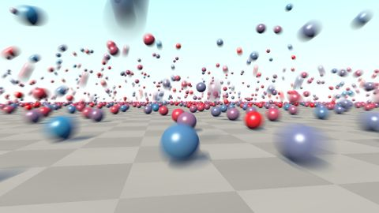

# [SH16B] Speed tracer
[View shader on Shadertoy](https://www.shadertoy.com/view/Xlt3Dn) - _Published on 2016-07-17_ 

This shader uses code of the Analytical Motionblur 3D shader by Inego and a grid to trace a lot of spheres.

## Shaders

### Image

Source: [Image.glsl](./Image.glsl)

## Links
* [[SH16B] Speed tracer](https://www.shadertoy.com/view/Xlt3Dn) on Shadertoy
* [An overview of all my shaders](https://reindernijhoff.net/shadertoy/)
* [My public profile](https://www.shadertoy.com/user/reinder) on Shadertoy

## License

[Creative Commons Attribution-NonCommercial-ShareAlike 4.0 International License.](https://creativecommons.org/licenses/by-nc-sa/4.0/)
