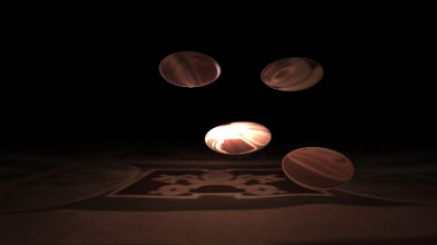

# [SH17A] Metaballs
[View shader on Shadertoy](https://www.shadertoy.com/view/Ms2fDh) - _Published on 2017-07-18_ 

3D metaballs in 280 chars.
## Shaders

### Image

Source: [Image.glsl](./Image.glsl)

#### Inputs

 * **iChannel0**: cubemap _(mipmap, repeat, vflipped)_

## Links
* [[SH17A] Metaballs](https://www.shadertoy.com/view/Ms2fDh) on Shadertoy
* [An overview of all my shaders](https://reindernijhoff.net/shadertoy/)
* [My public profile](https://www.shadertoy.com/user/reinder) on Shadertoy

## License

[Creative Commons Attribution-NonCommercial-ShareAlike 3.0 Unported License.](https://creativecommons.org/licenses/by-nc-sa/3.0/)
