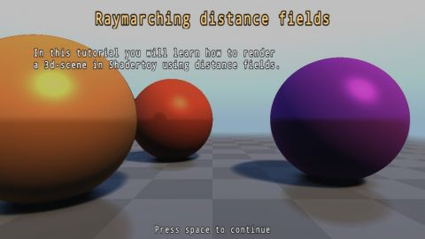

# [SH17C] Raymarching tutorial
[View shader on Shadertoy](https://www.shadertoy.com/view/4dSfRc) - _Published on 2017-07-30_ 

In this tutorial you will learn how to render a 3d-scene in Shadertoy
using distance fields.

The tutorial itself is created in Shadertoy, and is rendered
using ray marching a distance field.

The shader studied in the tutorial can be found here:
https://www.shadertoy.com/view/4dSBz3

Created for the Shadertoy Competition 2017

Most of the render code is taken from: 'Raymarching - Primitives' by Inigo Quilez.

You can find this shader here:
https://www.shadertoy.com/view/Xds3zN

## Shaders

### Buffer A

Source: [Buffer A.glsl](./Buffer&#32;A.glsl)

#### Inputs

 * **iChannel0**: Buffer A _(linear, clamp, vflipped)_
 * **iChannel1**: keyboard _(linear, clamp, vflipped)_
 * **iChannel2**: [texture](https://shadertoy.com/media/a/08b42b43ae9d3c0605da11d0eac86618ea888e62cdd9518ee8b9097488b31560.png) _(mipmap, repeat, vflipped)_

### Buffer B

Source: [Buffer B.glsl](./Buffer&#32;B.glsl)

#### Inputs

 * **iChannel0**: Buffer A _(linear, clamp, vflipped)_

### Buffer C

Source: [Buffer C.glsl](./Buffer&#32;C.glsl)

#### Inputs

 * **iChannel0**: Buffer A _(linear, clamp, vflipped)_
 * **iChannel1**: Buffer B _(linear, clamp, vflipped)_
 * **iChannel2**: Buffer C _(linear, clamp, vflipped)_

### Buffer D

Source: [Buffer D.glsl](./Buffer&#32;D.glsl)

#### Inputs

 * **iChannel0**: Buffer A _(linear, clamp, vflipped)_
 * **iChannel1**: Buffer D _(linear, clamp, vflipped)_
 * **iChannel2**: [texture](https://shadertoy.com/media/a/08b42b43ae9d3c0605da11d0eac86618ea888e62cdd9518ee8b9097488b31560.png) _(mipmap, repeat, vflipped)_

### Image

Source: [Image.glsl](./Image.glsl)

#### Inputs

 * **iChannel0**: Buffer A _(linear, clamp, vflipped)_
 * **iChannel1**: Buffer B _(linear, clamp, vflipped)_
 * **iChannel2**: Buffer C _(linear, clamp, vflipped)_
 * **iChannel3**: Buffer D _(linear, clamp, vflipped)_

## Links
* [[SH17C] Raymarching tutorial](https://www.shadertoy.com/view/4dSfRc) on Shadertoy
* [An overview of all my shaders](https://reindernijhoff.net/shadertoy/)
* [My public profile](https://www.shadertoy.com/user/reinder) on Shadertoy

## License

[Creative Commons Attribution-NonCommercial-ShareAlike 3.0 Unported License.](https://creativecommons.org/licenses/by-nc-sa/3.0/)
