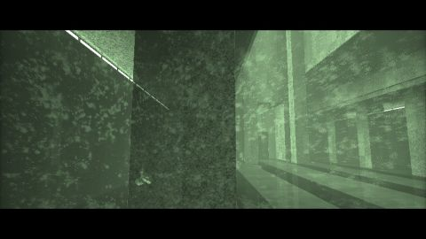

# [SIG15] Matrix Lobby Scene
[View shader on Shadertoy](https://www.shadertoy.com/view/MtsXzf) - _Published on 2015-08-07_ 

PLEASE REWIND ON FIRST LOAD (⏪), TO MAKE SURE AUDIO IS IN SYNC.
## Shaders

### Sound

Source: [Sound.glsl](./Sound.glsl)

#### Inputs

 * **iChannel0**: [texture](https://shadertoy.com/media/a/f735bee5b64ef98879dc618b016ecf7939a5756040c2cde21ccb15e69a6e1cfb.png) _(mipmap, repeat, vflipped)_

### Image

Source: [Image.glsl](./Image.glsl)

#### Inputs

 * **iChannel0**: [texture](https://shadertoy.com/media/a/f735bee5b64ef98879dc618b016ecf7939a5756040c2cde21ccb15e69a6e1cfb.png) _(mipmap, repeat, vflipped)_
 * **iChannel1**: [texture](https://shadertoy.com/media/a/fb918796edc3d2221218db0811e240e72e340350008338b0c07a52bd353666a6.jpg) _(mipmap, repeat, vflipped)_
 * **iChannel2**: [texture](https://shadertoy.com/media/a/92d7758c402f0927011ca8d0a7e40251439fba3a1dac26f5b8b62026323501aa.jpg) _(mipmap, repeat, vflipped)_

## Links
* [[SIG15] Matrix Lobby Scene](https://www.shadertoy.com/view/MtsXzf) on Shadertoy
* [An overview of all my shaders](https://reindernijhoff.net/shadertoy/)
* [My public profile](https://www.shadertoy.com/user/reinder) on Shadertoy

## License

[Creative Commons Attribution-NonCommercial-ShareAlike 3.0 Unported License.](https://creativecommons.org/licenses/by-nc-sa/3.0/)
