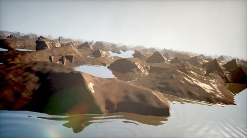

# Water world
[View shader on Shadertoy](https://www.shadertoy.com/view/lslGDB) - _Published on 2013-09-12_ 

As usual, almost al code is copy-paste from shaders by inigo quilez
Lens flare by musk! (https://www.shadertoy.com/view/4sX3Rs)

## Shaders

### Image

Source: [Image.glsl](./Image.glsl)

#### Inputs

 * **iChannel0**: [texture](https://shadertoy.com/media/a/3083c722c0c738cad0f468383167a0d246f91af2bfa373e9c5c094fb8c8413e0.png) _(mipmap, repeat, vflipped)_
 * **iChannel1**: [texture](https://shadertoy.com/media/a/1f7dca9c22f324751f2a5a59c9b181dfe3b5564a04b724c657732d0bf09c99db.jpg) _(mipmap, repeat, vflipped)_

## Links
* [Water world](https://www.shadertoy.com/view/lslGDB) on Shadertoy
* [An overview of all my shaders](https://reindernijhoff.net/shadertoy/)
* [My public profile](https://www.shadertoy.com/user/reinder) on Shadertoy

## License

[Creative Commons Attribution-NonCommercial-ShareAlike 3.0 Unported License.](https://creativecommons.org/licenses/by-nc-sa/3.0/)
