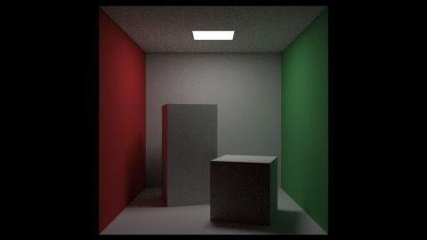

# Yet another Cornell Box
[View shader on Shadertoy](https://www.shadertoy.com/view/3dfGR2) - _Published on 2019-01-09_ 

Yet another Cornell Box. I have optimised the code of my shader "RIOW 2.07: Instances"
for the Cornell Box and added direct light sampling to reduce noise. Only Lambertian
solid materials and cubes are supported.

These shaders are my implementation of the raytracer described in the (excellent)
book "Ray tracing in one weekend" and "Ray tracing: the next week"[1] by Peter Shirley
(@Peter_shirley).

#### = Ray tracing in one week =
* Chapter  7: Diffuse                           https://www.shadertoy.com/view/llVcDz
* Chapter  9: Dielectrics                       https://www.shadertoy.com/view/MlVcDz
* Chapter 11: Defocus blur                      https://www.shadertoy.com/view/XlGcWh
* Chapter 12: Where next?                       https://www.shadertoy.com/view/XlycWh

#### = Ray tracing: the next week =
* Chapter  6: Rectangles and lights             https://www.shadertoy.com/view/4tGcWD
* Chapter  7: Instances                         https://www.shadertoy.com/view/XlGcWD
* Chapter  8: Volumes                           https://www.shadertoy.com/view/XtyyDD
* Chapter  9: A Scene Testing All New Features  https://www.shadertoy.com/view/MtycDD

[1] http://in1weekend.blogspot.com/2016/01/ray-tracing-in-one-weekend.html

## Shaders

### Image

Source: [Image.glsl](./Image.glsl)

## Links
* [Yet another Cornell Box](https://www.shadertoy.com/view/3dfGR2) on Shadertoy
* [An overview of all my shaders](https://reindernijhoff.net/shadertoy/)
* [My public profile](https://www.shadertoy.com/user/reinder) on Shadertoy
* [http://in1weekend.blogspot.com/2016/01/ray-tracing-in-one-weekend.html](http://in1weekend.blogspot.com/2016/01/ray-tracing-in-one-weekend.html)

## License

[Creative Commons Attribution-NonCommercial-ShareAlike 3.0 Unported License.](https://creativecommons.org/licenses/by-nc-sa/3.0/)
